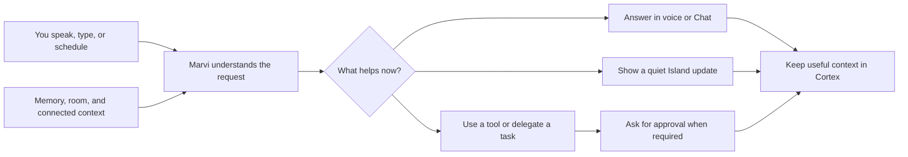

# Marvi OS

  <strong>Your computer, closer to a conversation.</strong> 
  An always-present Windows assistant for voice, memory, vision, and action.

  <a href="https://github.com/xRetr00/Marvi-OS/releases">Explore releases</a>
  ·
  <a href="#what-marvi-can-do">See what Marvi can do</a>
  ·
  <a href="#how-marvi-compares">Compare assistants</a>
  ·
  <a href="#start-with-marvi">Get started</a>

---

## Meet an assistant that lives with your day

Most assistants wait in a tab. Marvi stays close to what you are doing on Windows. Call her by voice or shortcut, ask naturally, and keep working. A compact **Dynamic Island** shows when she is listening, speaking, acting, or waiting for your approval. Open the control center when you want the full picture.

Marvi can remember a preference you mentioned last week, find a past conversation, help with a file, check on your room, or hand a longer task to a specialist. She can also decide that the useful thing to do is stay quiet.

> **“Marvi, remind me what we decided about the trip, find the document, and let me know when the room is empty.”**
>
> One request can draw on conversation history, connected context, local tools, and room state. Marvi shows the work and asks when an action needs your approval.

### Why Marvi feels different

| | What it means for you |
|---|---|
| **Voice is the front door** | Speak hands-free, interrupt, or switch to typing when a task needs more detail. |
| **The Island respects your focus** | A small desktop presence expands for speech, progress, alerts, and approvals, then gets out of the way. |
| **Memory is inspectable** | Explore what Marvi remembers, see where it came from, correct it, export it, or erase it. |
| **Action has a visible trail** | Follow delegated work, review activity, stop a task, and approve specific actions in Confirm mode. |
| **Your setup, your models** | Use local models or connect a provider. Add capabilities and accounts as you need them. |
| **Your world is part of the context** | With Smart Room connected, room presence and devices can inform helpful, timely responses. |

## What Marvi can do

### Talk without taking over your screen

Use a wake phrase or a global shortcut to begin. Marvi's voice experience is built around live conversation: she can listen while speaking, respond to interruption, and return to the background when the exchange ends. The voice stack uses local wake detection and local speech components, with the conversational model selected in your provider settings.

Prefer a keyboard? The control center has Chat for longer threads, attachments, images, dictation, source references, and read-aloud. You can move between a quick spoken request and a more detailed written one without changing assistants.

### See only what matters

The **Dynamic Island** is Marvi's glanceable home. It shows a live voice state, a concise announcement, a confirmation, or the progress of computer work. Background events do not pull the main window into focus. Quiet hours, cooldowns, presence, and Windows presentation state help Marvi choose when to speak and when to wait.

The control center gives you dedicated places for Voice, Chat, Vision, Smart Room, Activity, Cortex, connected capabilities, and preferences.

### Build a memory you can trust

**Marvi Cortex** connects useful facts, people, preferences, relationships, and recurring patterns. Memories retain their sources so you can ask *why* Marvi knows something. Inspect the graph, edit your identity and preferences, forget a fact, or export memory for your own use.

Your assistant's personality is yours to shape. Marvi keeps her editable identity separate from what she learns about you, so a preference does not silently rewrite her character.

### Turn requests into work

Marvi can search the web, work with files, use clipboard and media controls, schedule jobs, and call connected tools. File changes made through Marvi's file tools keep a checkpoint you can restore from Activity.

Longer tasks can go to a specialist while you keep talking:

| Specialist | Helps with | What you see |
|---|---|---|
| **Harvi** | Code and workspace tasks | A live job card with steps, status, and a final report |
| **Jarvi** | Windows apps and desktop actions | Island activity, Stop, and a private-input handoff |
| **Talos** | Browser tasks | Browser workspace and task progress |

Marvi can also hand coding work to supported outside agents through the Agent Client Protocol. Confirmations travel back to the same approval surface instead of disappearing inside a background process.

### Connect the digital and physical worlds

Connect accounts and tools through supported integrations, skills, plugins, and MCP. Marvi can use connected information as context while treating content from pages, messages, files, and services as untrusted data. A linked Telegram bot lets you reach the same Marvi away from your desk, including memory and approvals.

With **Smart Room**, Marvi can understand room presence, conditions, devices, gestures, and familiar faces. Camera analysis stays with the local room system; Marvi receives bounded observations and events rather than raw camera streams.

### Make time work for you

Create one-time reminders, repeating schedules, or bounded agent jobs. Choose the model and tools a job may use, review its run history, pause it, or run it on demand. Marvi's proactive mind can surface a meaningful event, defer it until a better moment, or leave you uninterrupted.

## How Marvi works

The local Gateway keeps sessions, tool execution, confirmations, and the activity trail together. The desktop presents that state; it does not need to stay open for Marvi's background services to keep working. You can see what she is doing, stop work, and decide what she may remember.

## Privacy and control are part of the experience

Raw microphone and camera streams stay local. A local wake listener and Smart Room process those signals on your machine. When you select a cloud model, the text and context needed for that request go to that provider; choose local models and local-only mode when you want model calls to remain on your machine.

| Your choice | How Marvi responds |
|---|---|
| **Confirm mode** | Marvi requests approval for actions she marks as needing it. A spoken answer or Island action can approve the exact request. |
| **YOLO mode** | Approval prompts are bypassed, with an unmistakable persistent indicator. Validation and activity history remain in place. |
| **Private input** | Pause browser or computer observation while you enter sensitive information yourself, then resume with a fresh view. |
| **Memory controls** | Inspect, correct, export, or delete what Cortex retains. |
| **Capability controls** | Choose connected accounts, models, tools, accessible folders, voice behavior, and proactive speech. |

## How Marvi compares

These products solve different parts of the assistant problem. The comparison describes each product's **primary experience**, based on its official documentation, rather than claiming that one product cannot do anything outside that focus.

| Assistant | Primary experience | When it may fit you best |
|---|---|---|
| **Marvi OS** | An ambient Windows voice and vision assistant that brings memory, desktop action, room context, and approvals into one local control center | You want a personal desktop presence that can talk, remember, act, and stay quiet |
| [OpenClaw](https://docs.openclaw.ai/) | A self-hosted gateway that connects an agent to many messaging channels and models | You want to reach an agent through the chat apps you already use |
| [Microsoft Copilot on Windows](https://support.microsoft.com/en-us/microsoft-copilot/getting-started-with-copilot-on-windows) | A Windows assistant with chat, voice, Vision, file search, and Microsoft account features | You want an assistant closely connected to Microsoft's Windows and cloud experiences |
| [ChatGPT Voice](https://help.openai.com/en/articles/20001274) | Live conversation in ChatGPT across supported apps and plans | You want conversational access to ChatGPT and its model ecosystem |
| [Home Assistant Assist](https://www.home-assistant.io/voice_control/) | Voice control for the smart home, including a fully local option | Your main goal is speaking to and automating home devices |

Marvi's focus is the space between those experiences: **the Windows desktop, your conversations, your room, and the work that continues after you stop speaking.**

## Where the project stands

Marvi OS is in active development. The desktop shell, Dynamic Island, Cortex, proactive behavior, Smart Room integration, scheduled jobs, setup flow, Telegram channel, and many tools have implementation and test coverage. Voice, the embedded browser, and native computer use have working implementations with remaining real-host acceptance and qualification work. The Jobs board and additional messaging channels are planned.

That distinction matters: a feature may be present in the codebase before every hardware, account, or long-running reliability gate is complete. See the [delivery phase index](docs/phases/README.md) for current status and evidence.

## Start with Marvi

1. Visit [Marvi OS releases](https://github.com/xRetr00/Marvi-OS/releases) for available Windows builds.
2. Run the Marvi bootstrap and follow setup to choose the components your machine needs.
3. Connect a model provider or select a local model, then add voice, room, browser, computer, and account capabilities as you want them.
4. Call Marvi by voice or shortcut. The Island is ready when you are.

Setup verifies downloads and can resume interrupted ones. The control center helps you manage providers and capabilities later, so your first configuration does not have to be final. For setup details and current requirements, see [Setup](docs/SETUP.md).

---

  <strong>Voice. Vision. Memory. Action.</strong> 
  More help when it matters. More space when it doesn't.

  <a href="https://github.com/xRetr00/Marvi-OS/releases">Explore releases</a>
  ·
  <a href="docs/phases/README.md">See progress</a>
  ·
  <a href="LICENSE">MIT License</a>

