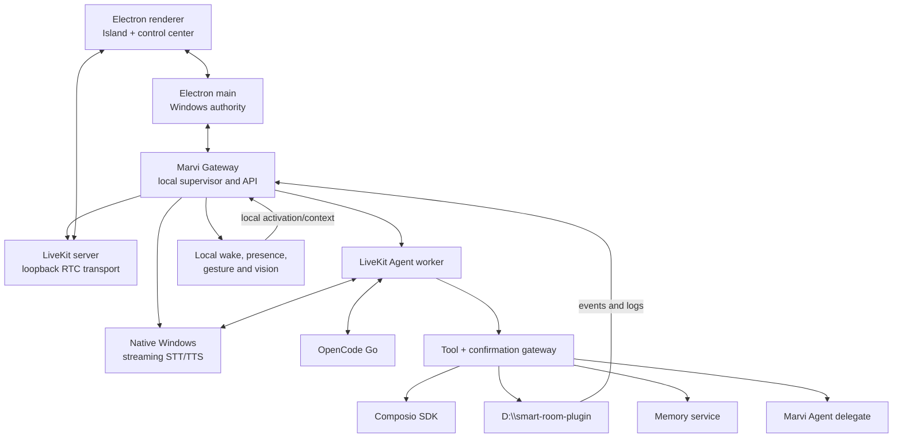

# Architecture

## Outcome

Marvi OS is a local Windows product composed of supervised processes. The user
sees one service—**Marvi Gateway**—while diagnostics preserve the names and
versions of the upstream components it manages.

## Process topology

## Why LiveKit is local but not embedded in the renderer

LiveKit Server supports local Windows development. Marvi Gateway will supervise
the pinned LiveKit server binary, bind it to loopback, generate per-installation
credentials, and expose health through one local facade. Electron and the agent
join local rooms through official SDKs.

The server is a sidecar, not a library linked into renderer code. This preserves
process isolation, reliable restart, upstream updates, and clear diagnostics.
There is no Cloud mode in the initial product.

## Marvi Gateway responsibilities

Marvi Gateway is the only backend address known to the renderer. It owns:

- readiness and health aggregation;
- LiveKit token issuance for local rooms;
- supervised start/stop/restart of pinned sidecars;
- session identity and reconnect state;
- confirmation tokens and YOLO mode state;
- structured tool and audit events;
- Smart Room event subscription;
- Composio connection status;
- memory access;
- update/status information.

It does not implement RTC, STT, TTS, home automation, OAuth providers, or model
inference itself.

## Always-on lifecycle

Electron main starts Marvi Gateway at login. Gateway starts the minimum idle
set: local LiveKit transport, wake word, room subscription, presence/gesture
pipeline, and health monitoring. STT/TTS residency follows the result of the
voice benchmark: resident if the combined budget is safe, otherwise an explicit
warm/sleep profile with measured wake latency.

Closing the main window leaves the tray, Dynamic Island, Gateway, wake word,
and the Gateway-owned Smart Room sidecar alive. The sidecar owns camera
presence, gestures, and room events. Exiting from the tray stops them in
dependency order.

## Media privacy boundary

Microphone capture stays local for wake word and the LiveKit voice session.
Smart Room is the sole always-on camera owner for presence and gestures. Raw
frames remain inside the sidecar and are never published to Gateway or the
loopback LiveKit room. OpenCode Go receives bounded text facts, not raw audio or
video, unless a future explicit feature changes this contract.

## Full-duplex media contract

Marvi OS never switches the microphone off merely because the assistant is
speaking. Electron's LiveKit/Chromium capture enables WebRTC acoustic echo
cancellation and noise suppression, and the STT adapter continues consuming
frames during playback. Local VAD can therefore detect a barge-in immediately.

The agent pins LiveKit's audio `TurnDetector` to `v1-mini`, which runs locally
on CPU; it must not auto-select LiveKit Inference. VAD handles speech-start and
interruption timing, while the audio turn detector decides whether a pause is a
completed thought. An interruption cancels the TTS producer and clears already
queued playout together. The foreground voice loop must not wait for a long tool
call before yielding.

## Agent structure

The foreground conversational agent has a minimal instruction set and a small
tool router. Account domains, room work, memory retrieval, and Marvi delegation
are scoped tasks/toolsets rather than a single permanent schema. The agent uses
structured LiveKit tools and workflows; generated marker strings are forbidden
for routing.

## Smart Room boundary

`D:\smart-room-plugin` remains independently runnable and authoritative for the
bulb, mmWave sensor, presence fusion, automations, state, and room history.
Marvi OS consumes:

- a health endpoint;
- structured action calls;
- an ordered event stream with reconnect cursor;
- structured logs suitable for the Activity view.

The existing bridge/event bus is audited before any new protocol is introduced.
Room failures must degrade the room panel without disabling voice.

## Accounts and world context

Composio supplies supported OAuth connections and actions. Marvi OS stores only
connection identifiers and local projections needed for status, retrieval, and
audit. External content is retrieved on demand or ingested as bounded events;
it is not dumped wholesale into the voice prompt.

World context has three layers:

1. A tiny live summary for immediate conversational awareness.
2. Retrieval tools for current detail.
3. A normalized event/memory store for durable history.

## Confirmation protocol

In Confirm mode, the model proposes an action and may mark it as requiring
confirmation. Gateway creates a short-lived token bound to the exact tool,
arguments, account, and session. Spoken or Island approval resolves that token.
Changed arguments require a new token.

In YOLO mode, Gateway executes without creating confirmation tokens. It still
validates schemas/authentication and writes the same append-only audit event.

## Version and update architecture

Product versions come from `VERSION`; builds embed the Git commit and build
time. There are two update channels, both surfaced in Updates and About:

- `release` (default, opt-out): update to the latest signed `v*` tag. Never
  fast-forwards a moving branch; integrity rests on HTTPS plus (when signing is
  configured) `git verify-tag`, otherwise on pinning the exact tag commit.
- `dev` (opt-in): fast-forward `origin/main` and run whatever is there.

The updater is the small Tauri binary `marvi-bootstrap.exe` (`apps/updater`).
It is both installer and updater, and lives in `%LOCALAPPDATA%\Marvi OS\bin`;
the standalone installer copies itself there on a fresh install. The flow:

1. The renderer's Updates panel shows the channel and can run a read-only
   check (the bootstrap `check` mode) that reports the target commit and how
   far behind the install is, without quitting.
2. The user applies; Electron quits and hands off to the bootstrap with the
   install root, channel, its own pid, and the relaunch target.
3. The bootstrap waits for the app to exit (fails closed), verifies the
   checkout is clean, records the pre-update commit, then fetches the target
   (`origin/main` for dev, the latest tag for release).
4. It snapshots the built runtime, applies the target, runs `npm ci` +
   `npm run build:unpack`, and smoke-tests the produced runtime.
5. On success it writes a result marker and relaunches. On any failure it
   restores the previous commit and built runtime, then relaunches — a failed
   update always leaves the last working installation.

The implementation was extracted from the predecessor assistant' handoff
contract rather than independently recreated (see `docs/UPSTREAM.md`).
