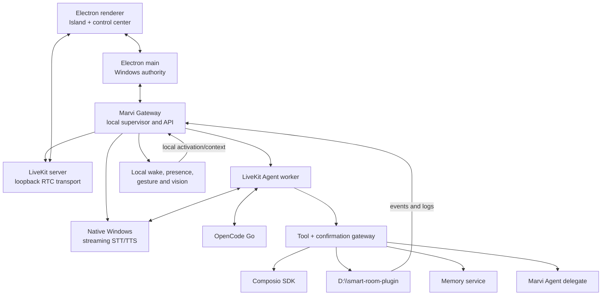

# Architecture

## Outcome

Marvi OS is a local Windows product composed of supervised processes. The user
sees one service—**Marvi Gateway**—while diagnostics preserve the names and
versions of the upstream components it manages.

## Process topology

## Why LiveKit is local but not embedded in the renderer

LiveKit Server supports local Windows development. Marvi Gateway will supervise
the pinned LiveKit server binary, bind it to loopback, generate per-installation
credentials, and expose health through one local facade. Electron and the agent
join local rooms through official SDKs.

The server is a sidecar, not a library linked into renderer code. This preserves
process isolation, reliable restart, upstream updates, and clear diagnostics.
There is no Cloud mode in the initial product.

## Marvi Gateway responsibilities

Marvi Gateway is the only backend address known to the renderer. It owns:

- readiness and health aggregation;
- LiveKit token issuance for local rooms;
- supervised start/stop/restart of pinned sidecars;
- session identity and reconnect state;
- confirmation tokens and YOLO mode state;
- structured tool and audit events;
- Smart Room event subscription;
- Composio connection status;
- memory access;
- update/status information.

It does not implement RTC, STT, TTS, home automation, OAuth providers, or model
inference itself.

## Always-on lifecycle

Electron main starts Marvi Gateway at login. Gateway starts the minimum idle
set: local LiveKit transport, wake word, room subscription, presence/gesture
pipeline, and health monitoring. STT/TTS residency follows the result of the
voice benchmark: resident if the combined budget is safe, otherwise an explicit
warm/sleep profile with measured wake latency.

Closing the main window leaves the tray, Dynamic Island, Gateway, wake word,
camera presence, gesture detection, and room events alive. Exiting from the tray
stops them in dependency order.

## Media privacy boundary

Microphone and camera capture are always available locally because wake word,
presence, and gestures are always on. Raw frames remain inside local processes.
An active assistant session publishes only the media required by that session to
the loopback LiveKit room. OpenCode Go receives text context, not raw audio or
video, unless a future explicit feature changes this contract.

## Full-duplex media contract

Marvi OS never switches the microphone off merely because the assistant is
speaking. Electron's LiveKit/Chromium capture enables WebRTC acoustic echo
cancellation and noise suppression, and the STT adapter continues consuming
frames during playback. Local VAD can therefore detect a barge-in immediately.

The agent pins LiveKit's audio `TurnDetector` to `v1-mini`, which runs locally
on CPU; it must not auto-select LiveKit Inference. VAD handles speech-start and
interruption timing, while the audio turn detector decides whether a pause is a
completed thought. An interruption cancels the TTS producer and clears already
queued playout together. The foreground voice loop must not wait for a long tool
call before yielding.

## Agent structure

The foreground conversational agent has a minimal instruction set and a small
tool router. Account domains, room work, memory retrieval, and Marvi delegation
are scoped tasks/toolsets rather than a single permanent schema. The agent uses
structured LiveKit tools and workflows; generated marker strings are forbidden
for routing.

## Smart Room boundary

`D:\smart-room-plugin` remains independently runnable and authoritative for the
bulb, mmWave sensor, presence fusion, automations, state, and room history.
Marvi OS consumes:

- a health endpoint;
- structured action calls;
- an ordered event stream with reconnect cursor;
- structured logs suitable for the Activity view.

The existing bridge/event bus is audited before any new protocol is introduced.
Room failures must degrade the room panel without disabling voice.

## Accounts and world context

Composio supplies supported OAuth connections and actions. Marvi OS stores only
connection identifiers and local projections needed for status, retrieval, and
audit. External content is retrieved on demand or ingested as bounded events;
it is not dumped wholesale into the voice prompt.

World context has three layers:

1. A tiny live summary for immediate conversational awareness.
2. Retrieval tools for current detail.
3. A normalized event/memory store for durable history.

## Confirmation protocol

In Confirm mode, the model proposes an action and may mark it as requiring
confirmation. Gateway creates a short-lived token bound to the exact tool,
arguments, account, and session. Spoken or Island approval resolves that token.
Changed arguments require a new token.

In YOLO mode, Gateway executes without creating confirmation tokens. It still
validates schemas/authentication and writes the same append-only audit event.

## Version and update architecture

Product versions come from `VERSION`; builds also embed the Git commit and build
time. Update channels map to Git branches (`stable`, `beta`, or an explicitly
configured development branch).

The Windows update path reuses the Marvi/Hermes repository-owned handoff:

1. Gateway fetches update metadata and compares the installed commit.
2. UI shows the target version/commit list in Updates and About.
3. User applies; Electron quits after saving state.
4. A detached checkout-owned PowerShell script waits for process exit.
5. It fetches, validates, updates into a staging location, installs dependencies,
   builds/packages, and runs update smoke tests.
6. It swaps only after success, writes a result marker, and relaunches.
7. On failure it preserves and relaunches the last working installation.

The implementation should be extracted from Marvi's existing updater rather
than independently recreated.
