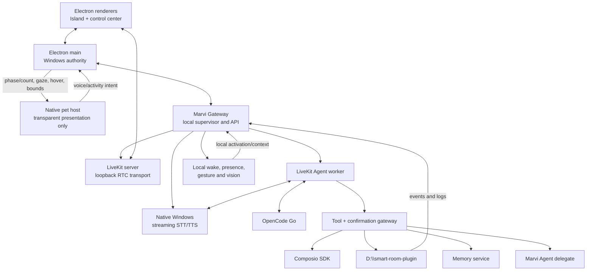

# Architecture

## Outcome

Marvi OS is a local Windows product composed of supervised processes. The user
sees one service—**Marvi Gateway**—while diagnostics preserve the names and
versions of the upstream components it manages.

## Process topology

## Why LiveKit is local but not embedded in the renderer

LiveKit Server supports local Windows development. Marvi Gateway will supervise
the pinned LiveKit server binary, bind it to loopback, generate per-installation
credentials, and expose health through one local facade. Electron and the agent
join local rooms through official SDKs.

The server is a sidecar, not a library linked into renderer code. This preserves
process isolation, reliable restart, upstream updates, and clear diagnostics.
There is no Cloud mode in the initial product.

## Marvi Gateway responsibilities

Marvi Gateway is the only backend address known to the renderer. It owns:

- readiness and health aggregation;
- durable chat threads, message ancestry/branches, ordered content parts,
  attachment lifecycle, validated generative-widget data, authoritative context
  facts, and per-thread provider/model selection;
- bounded dictation sessions that adapt renderer PCM to an Agent-owned
  Parakeet worker without moving inference into React;
- LiveKit token issuance for local rooms;
- supervised start/stop/restart of pinned sidecars;
- session identity and reconnect state;
- confirmation tokens and YOLO mode state;
- structured tool and audit events;
- durable user cron jobs, isolated run history, and their provider/model/tool policy;
- Smart Room event subscription;
- connector connection status;
- memory access;
- update/status information.

### ARC: memory, mind, and subconscious cycle

ARC is the product name for Marvi's existing Gateway-owned cognition boundary,
not another agent process. It has three stages:

1. **Observe** — trusted and untrusted events enter the durable journal with
   provenance; memories remain episodic or semantic in the local SQLite store.
2. **Reflect** — the policy-bounded mind selects the least intrusive useful
   surface and the scheduled reflection pass promotes stable repetition.
3. **Commit** — decisions, memories, relationships, and audit evidence are
   written by the Gateway. Tool side effects still pass through confirmation
   or the visible YOLO mode.

The initiative scheduler is ARC's subconscious loop: bounded ingest, mind,
reflection, and consolidation jobs. An idle tick is a no-op, failures remain
visible, and no cognition runs in React. The control center reads a projection
from `/arc/memory/graph`; it never receives a SQLite handle or mutation
authority. Tree mode groups memories by provenance, while Connections mode
shows explicit entity relationships.

Every LLM-assisted ARC operation is an auxiliary job. Mind deliberation and
presence judgement use the `mind` role; scheduled and manual reflection use the
`memory` role. A role pinned in Models → Auxiliary selects that provider/model;
Auto uses the active provider's `default_aux_model`. Deterministic memory
search, ingest, graph projection, and consolidation do not call an LLM.
Mind deliberation and memory reflection share a Gateway cognition harness that
prepends SOUL.md, USER.md, local date/time, and the task brief. It offers only a
fixed read-only subset of the existing registry (`memory_recall`, graph
neighbours, web search/extract, workspace list/read, and Mind diagnostics).
Skills, commands, writes, account actions, dynamic external tools, and
confirmation bypasses are absent; the loop is capped at three model rounds.
Provider calls and ARC jobs record route, model, timing, usage, outcome, and
stable event/call identifiers in the rotating subsystem logs without recording
prompts, completions, memory bodies, or external account payloads.

Gmail, Google Calendar, Slack, Notion, GitHub, and Google Drive are native
memory providers. The bounded ingest tick runs each active connection with its
own durable cursor, content fingerprint set, last success/error, and item
counts. New or changed items are written to durable memory as untrusted external
content and enter the journal for the subconscious policy loop. Realtime
Composio triggers take the same route, can prompt an immediate provider sync,
and never become instructions. `memory_recall` is the
canonical read-only Gateway tool: typed Chat receives it from the same registry
that publishes `/tools`, and the LiveKit voice worker's spoken `recall` adapter
invokes that published tool route.
`memory_search` remains a compatibility alias. This native tool is preferred to
adding an in-process MCP server; external MCP clients can still reach Gateway
tools through the existing bridge boundary.

Durable conversational memory is selected behind the Gateway-owned
`MemoryProvider` protocol. Exactly one of `local`, `mem0`, or `honcho` owns
observe and recall at a time. Local search keeps its embedding implementation
below the adapter; external providers receive text and own extraction,
embedding, and consolidation. Honcho receives user and assistant messages as
separate peer-attributed messages and recall uses session context (summary,
representation, and peer card). Mem0 receives the same two-role message list
and is pinned to 1.0.11 because current 2.x extraction is ADD-only. The local
ARC reflection/dreamer jobs become no-ops while an external provider is active,
so there is no shadow store or merged answer.

It does not implement RTC, STT, TTS, home automation, OAuth providers, or model
inference itself.

### User cron jobs

User schedules are separate from ARC's fixed internal ticks. Their durable
SQLite records belong to Marvi Gateway; APScheduler is only the replaceable
clock rebuilt from those records. Jobs accept one-shot durations/timestamps,
recurring intervals, and five-field cron expressions. A fixed action job can
write a reminder or invoke an existing ARC operation. An agent job runs a
self-contained prompt through ProviderClient with optional per-job provider,
model, reasoning effort, and an exact ToolRegistry allowlist. It has no Chat
transcript and no private action path.

Every attempt is recorded before execution and finished with route, model,
tokens, tools, bounded output, error, and delivery outcome. Scheduled tool
calls use the same audit and Confirm/YOLO boundary as Chat and Voice; a tool
that needs live confirmation fails the unattended run visibly instead of
bypassing policy. Creation and other standing-instruction mutations are
sensitive model tools themselves.

Delivery is a Gateway protocol boundary rather than platform logic in the
scheduler. The installed adapter exposes only `local` (save output). A future
messaging subsystem registers destinations and implements delivery without
changing cron records, execution, or the desktop contract.

## Always-on lifecycle

Electron main starts Marvi Gateway at login. Gateway starts the minimum idle
set: local LiveKit transport, wake word, room subscription, presence/gesture
pipeline, and health monitoring. STT/TTS residency follows the result of the
voice benchmark: resident if the combined budget is safe, otherwise an explicit
warm/sleep profile with measured wake latency.

Closing the main window leaves the tray, Dynamic Island, optional desktop pet,
Gateway, wake word, and the Gateway-owned Smart Room sidecar alive. Electron
main owns pet-helper supervision, placement, persistence, and cursor
quantization. The focused native helper owns only its transparent layered
window, atlas decode, authored frame timer, status/control drawing, and bounded
alpha-aware pointer hit-testing. Visible sprite pixels behave as a native drag
surface while transparent gaps remain click-through. It receives assistant
phase/count, direction index, hover, and bounds over stdin, and emits only
voice/activity button intents plus a final drag position over stdout. Electron
main validates and persists that position and interprets button intents by
navigating existing views. The helper cannot reach Gateway, focus itself, or
execute tools. The Smart Room
sidecar owns camera presence, gestures, and room events. Exiting from the tray
stops them in dependency order.

## Media privacy boundary

Microphone capture stays local for wake word and the LiveKit voice session.
Smart Room is the sole always-on camera owner for presence and gestures. Raw
frames remain inside the sidecar and are never published to Gateway or the
loopback LiveKit room. OpenCode Go receives bounded text facts, not raw audio or
video, unless a future explicit feature changes this contract.

## Full-duplex media contract

Marvi OS never switches the microphone off merely because the assistant is
speaking. Electron's LiveKit/Chromium capture enables WebRTC acoustic echo
cancellation and noise suppression, and the STT adapter continues consuming
frames during playback. Local VAD can therefore detect a barge-in immediately.

The agent pins LiveKit's audio `TurnDetector` to `v1-mini`, which runs locally
on CPU; it must not auto-select LiveKit Inference. VAD handles speech-start and
interruption timing, while the audio turn detector decides whether a pause is a
completed thought. An interruption cancels the TTS producer and clears already
queued playout together. The foreground voice loop must not wait for a long tool
call before yielding.

## Agent structure

The foreground conversational agent has a minimal instruction set and a small
tool router. Account domains, room work, memory retrieval, and Marvi delegation
are scoped tasks/toolsets rather than a single permanent schema. The agent uses
structured LiveKit tools and workflows; generated marker strings are forbidden
for routing.

## Smart Room boundary

`D:\smart-room-plugin` remains independently runnable and authoritative for the
bulb, mmWave sensor, presence fusion, automations, state, and room history.
Marvi OS consumes:

- a health endpoint;
- structured action calls;
- an ordered event stream with reconnect cursor;
- structured logs suitable for the Activity view.

The existing bridge/event bus is audited before any new protocol is introduced.
Room failures must degrade the room panel without disabling voice.

## Capabilities: connectors and world context

Skills, Connectors, MCP and third-party plugins are one sidebar section.
Settings keeps Marvi's own plugins — Smart Room and what follows it — because
what Marvi *can reach* and what Marvi *is* are different questions.

Composio supplies hosted OAuth connections and actions, and Marvi talks to it
directly with the user's own project key. There is no Marvi-hosted broker and
no plan for one: Marvi is a single-user desktop product, so the questions a
broker exists to answer — multi-tenancy, billing, credential custody for
someone else — do not arise. See ADR-027.

Electron asks Gateway for a Connect Link and opens only an HTTPS
`*.composio.dev` URL in the system browser. Gateway owns reconnect,
enable/disable, revoke, sync, and audit; Marvi stores connection identifiers
and local policy/sync projections, never provider tokens. Each installation
addresses Composio under its own generated entity id rather than the literal
`"default"`, which would make two installations share one identity. The
project key is entered on Capabilities › Connectors, validated before being
written to the existing local provider-settings store, never returned to the
renderer, and activates the broker and trigger listener without a Gateway
restart.

Disconnecting retracts what the connection put into memory. Ingest and
triggers write external content into the memory graph continuously, so a
revoked connection whose emails stayed recallable would leave Marvi asserting
things she can no longer check; the ingest ledger keys on
`(toolkit, connection_id, provider_id)` and the count is shown before the
disconnect, not after.

A connected service surfaces in three places, not four: as an agent tool, as a
memory source on the ingest schedule, and as a trigger source. There is no
personalization surface for it to feed — `USER.md` is user-authored and
`note_about_user` is model-invoked — so `/connectors` reports that place as
absent rather than implying one exists.

The stable `account_tool_search` and `account_tool_execute` broker tools expose
the live Composio catalog without loading hundreds of schemas into every LLM
turn. Search returns only tools permitted by the toolkit's user-selected
read/write/admin ceiling. Execution re-resolves the schema and scope. Reads are
wrapped as untrusted; write/admin calls dynamically inherit confirmation,
external-write idempotency, and audit. Typed Chat and LiveKit Voice receive the
same nested JSON schema from `/tools` and call the same Gateway route.

World context has three layers:

1. A tiny live summary for immediate conversational awareness.
2. Retrieval tools for current detail.
3. A normalized event/memory store for durable history.

Typed Chat also performs bounded automatic recall from the current user turn;
voice recalls on demand through its spoken tool so the realtime prompt remains
small. Both paths preserve the untrusted envelope stored by the memory service.

## Confirmation protocol

In Confirm mode, the model proposes an action and may mark it as requiring
confirmation. Gateway creates a short-lived token bound to the exact tool,
arguments, account, and session. Spoken or Island approval resolves that token.
Changed arguments require a new token.

In YOLO mode, Gateway executes without creating confirmation tokens. It still
validates schemas/authentication and writes the same append-only audit event.

## Version and update architecture

Product versions come from `VERSION`; builds embed the Git commit and build
time. There are two update channels, both surfaced in Updates and About:

- `release` (default, opt-out): update to the latest signed `v*` tag. Never
  fast-forwards a moving branch; integrity rests on HTTPS plus (when signing is
  configured) `git verify-tag`, otherwise on pinning the exact tag commit.
- `nightly` (opt-in): fast-forward `origin/main` and run whatever is there.

The updater is the small Tauri binary `marvi-bootstrap.exe` (`apps/updater`).
It is both installer and updater, and lives in `%LOCALAPPDATA%\Marvi OS\bin`;
the standalone installer copies itself there on a fresh install. The flow:

1. The renderer's Updates panel shows the channel and can run a read-only
   check (the bootstrap `check` mode) that reports the target commit and how
   far behind the install is, without quitting.
2. The user applies; Electron quits and hands off to the bootstrap with the
   install root, channel, its own pid, and the relaunch target.
3. The bootstrap waits for the app to exit (fails closed), verifies the
   checkout is clean, records the pre-update commit, then fetches the target
   (`origin/main` for nightly, the latest tag for release).
4. It snapshots the built runtime, applies the target, runs `npm ci` +
   `npm run build:unpack`, and smoke-tests the produced runtime.
5. On success it writes a result marker and relaunches. On any failure it
   restores the previous commit and built runtime, then relaunches — a failed
   update always leaves the last working installation.

The implementation was extracted from the predecessor assistant' handoff
contract rather than independently recreated (see `docs/UPSTREAM.md`).
