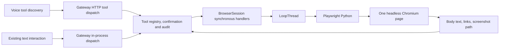

# Browser architecture review

Reviewed 2026-09-07, before preparing the replacement browser plan. Local
baseline: `ce97137f06b0ca012b12345ffe49309399e116b7`. Static code/document
review only; no new browser packages installed and no runtime acceptance claimed.

## Current execution path

`app.py` registers `BrowserSession()` when `MARVI_BROWSER` is enabled.
The instance lives through registered handler closures. The session launches
Chromium lazily with `headless=True`, creates a nonpersistent context and one
page, and keeps it until explicitly closed. It is not associated with a user
profile, conversation ID, browser job, or tab collection.

## Findings and implementation consequences

| Finding | Local evidence | Consequence for the browser plan |
|---|---|---|
| A real browser already exists, but is invisible by default | `services/gateway/src/marvi_gateway/browser.py`: `_launch`, `BrowserSession.__init__` | Reuse Chromium; add a visible, owned browser workspace rather than build an engine. |
| No durable browser identity | `_launch` uses `new_context`; `_page` is the only retained target | Separate persistent profile, live browser session, and resumable task. Preserve profile data after closing a process. |
| Page observations cannot ground most controls | `_snapshot` returns body text capped at 12,000 characters; `click`/`type_text` require selectors | Use upstream structured observations and/or screenshot grounding, with freshness and target identity. |
| Shared mutable page | `_current` lazily creates one page without a lock; all handlers close over the same instance | Serialize session creation/actions and bind calls to task/session/tab. Existing callers can race even if voice usually acts sequentially. |
| No explicit browser shutdown in Gateway lifespan | `app.py`: browser registration and `lifespan` teardown | Retain an owned browser service; flush/close gracefully before Electron's existing process-tree fallback. Do not claim present shutdown is graceful browser cleanup. |
| Timeout can leave action running | `background.py`: `run_coroutine_threadsafe(...).result(timeout)` does not cancel its future | Cancellation must reach the queued/running action and invalidate late results. A timeout is an uncertain outcome, not permission to retry a submission. |
| Voice and browser deadlines disagree | `services/agent/src/marvi_agent/tools.py`: `REQUEST_TIMEOUT=12`; browser launch wait is 90 seconds, navigation 30 seconds, action 15 seconds | Return a browser job receipt quickly and report completion separately. Do not hold an HTTP request through a human login. |
| Tool result vocabulary lacks human handoff | `app.py`: `ToolInvocation` has executed/confirmation_required/denied/failed; `ToolCall` has arguments/idempotency key | Add browser-specific task states and a correlated human-input request without misusing action confirmation. |
| Long task continuation is missing from browser | `chat.py`: synchronous dispatch and eight tool rounds; agent tools call `/tools/{tool}` | Browser work needs bounded checkpoints across turns and explicit resumption, not an unlimited voice tool loop. Reuse existing orchestration interfaces. |
| Fixed action flags contradict requested policy | `browser.py`: click/type sensitive; `app.py`: both dispatch paths use `is_sensitive` | Reconcile browser Confirm behavior with AGENTS.md's model-requested approval; preserve YOLO and exact-target tokens. |
| Browser effects are not designated external writes | Browser `ToolSpec` entries leave `external=False`; Gateway dedup uses `is_external` | Add task/action IDs and unknown-outcome handling. Browser UI cannot promise exactly-once remote effects. |
| Initial URL checking is not browser network isolation | `open` calls `assert_public_http_url`; no context-wide request/redirect policy | Correct ADR-017, test redirects/subresources/popups, and state the actual network boundary. |
| Downloads/dialogs are intentionally refused | `accept_downloads=False`, download cancellation, dialog dismissal | Explicitly revise this contract for user-requested file transfers and blocking dialogs. |
| Screenshot path is not an image delivered to a model | `browser_screenshot` returns a path; `screen.py` separately sends primary-display captures to the vision role | Add bounded browser observation artifacts and a verified image/vision path, including a shared private-input capture interlock. |
| Audit currently accepts raw arguments before execution | `app.py`: requested audit; `ToolSpec.summary`; voice `_watch` includes arguments | Redaction must precede all logs, summaries, model history, and telemetry. Never route login secrets through ordinary tool arguments. |
| Generic MCP adapter is insufficient as-is | `mcp_bridge.py`: basic schema mapping, text/string content conversion, entered stdio/session context managers not retained for exit | If used, test full schema/error/content handling and lifecycle over real stdio. `ToolSpec.schema` exists already; reuse it. |
| Setup can confuse package availability with a launchable engine | `config/components.json`: browser check runs `playwright --version`; setup TUI exposes only `MARVI_BROWSER` | Test browser executable presence and a real isolated launch; expose installed/enabled/ready/profile/session states separately. |
| Browser Use name in skill catalog is not runtime integration | `config/skill-sources.json` lists its skill repository; Gateway dependency is Playwright | Do not advertise Browser Use as installed because its skills can be discovered. |
| No browser workspace or takeover bridge | desktop main/shared/preload/renderer searches show ordinary external auth opening and generic tool cards | Add explicit browser status and control actions. Existing connector OAuth remains Composio-owned. |

Existing useful boundaries: Gateway tools/audit/authentication, dynamic voice
tool discovery, provider/auxiliary vision routing, filesystem access resolution,
central paths, setup manifests, and Electron process-tree supervision. Keep
them. Review their browser-specific seams rather than replacing the platform.

The current browser tests use fake sessions for policy and an in-process ASGI
client. The single real Chromium fixture directly accesses the private page
and bypasses URL validation to visit loopback. It proves reading/links, not a
real Gateway-process navigation boundary, persistent login, form execution,
private input, or user takeover. No test run was performed during this review:
the Gateway project-local virtual environment was absent, and installing a test
environment is unnecessary for a documentation-only milestone.

## Hermes and upstream findings

Hermes documents a headed browser that stays open between turns for watching
and manual sign-in intervention. Its default driver, when available, is Browser
Use CLI via `browser_exec`; browser source and driver are separate choices.
Profile persistence is distinct from keeping a live window open. Its default
inactivity cleanup is unsuitable for an unlimited human login wait without
adaptation. [Hermes browser documentation](https://hermes-agent.nousresearch.com/docs/user-guide/features/browser)

Browser Use's current CLI is backed by Browser Harness, accepts Python, and can
connect to a supplied CDP endpoint. This supports evaluating a Marvi-managed
browser rather than automatically discovering the user's personal Chrome.
[Browser Use CLI](https://docs.browser-use.com/open-source/browser-use-cli)

Browser Harness supplies an MCP helper interface as well as programmable
execution. Its current helper source uses coordinate clicks and selector fills;
`page_info` is metadata, not a complete accessibility snapshot. Do not assume it
already supplies stable semantic element references or a private-input barrier.
[MCP interface](https://github.com/browser-use/browser-harness/blob/main/docs/MCP.md),
[helper server source](https://github.com/browser-use/browser-harness/blob/main/src/mcp_server.py)

The reviewed Browser Use manifest declares `mcp==2.1.1`; the Harness MCP extra
also declares 2.1.1. Gateway declares `mcp>=1.9,<2`. An isolated driver environment
avoids dependency collision; actual protocol interoperability still needs a test.
Manifest versions observed: Browser Use 0.13.10 and Harness 0.1.13. These are
research observations, not adopted production pins or proof of CLI release naming.
[Browser Use manifest](https://github.com/browser-use/browser-use/blob/main/pyproject.toml),
[Harness manifest](https://github.com/browser-use/browser-harness/blob/main/pyproject.toml)

Playwright already provides persistent contexts; its documentation warns against
automating the normal Chrome user-data directory and concurrent instances of the
same directory. Use a dedicated Marvi profile with a single owning process.
[Playwright BrowserType](https://playwright.dev/python/docs/api/class-browsertype#browser-type-launch-persistent-context)

## Review conclusion

The primary gap is a browser workspace lifecycle, not a missing Chromium binary.
Build visible browsing, durable profiles, task ownership, and human handoff as
one product contract. Evaluate Browser Use/Harness first for agent control;
retain existing Playwright as the upstream browser launcher and comparison
baseline. Raw execution must not bypass pause, private input, or confirmation.

The previous Playwright-MCP/Windows-MCP-first plan is superseded by the
[browser-only delivery plan](phases/14-browser-computer-use.md). Computer-use
architecture will be reviewed after browser delivery, considering cua-driver
and other maintained options without preselecting Windows-MCP.
