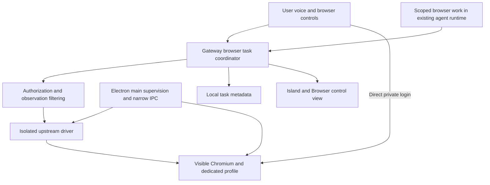
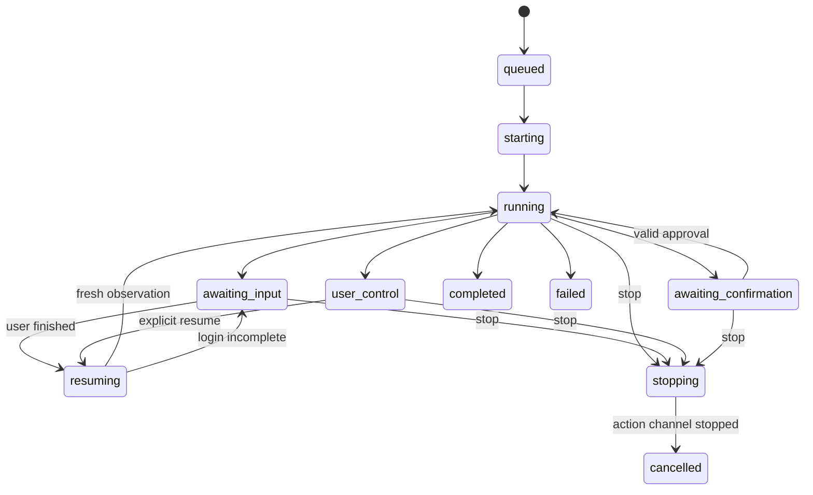

# Phase 14 — Visible persistent agent browser

Status: implementation under qualification, 2026-09-08. Architecture review and
plan completed 2026-09-07. This browser-only plan supersedes the earlier
combined browser/computer-use proposal. The filename is retained for existing
links. Read the [current architecture review](../BROWSER-ARCHITECTURE-REVIEW.md)
first; it was completed before preparing this plan.

Computer use is a separate planning exercise after browser delivery passes
acceptance. That review will consider cua-driver and maintained alternatives.
Windows-MCP is not a selected dependency.

## Implementation evidence — 2026-09-08

Implemented the visible Playwright persistent workspace, profile lifecycle,
session/tab IDs and revisions, asynchronous action receipts, explicit dialogs,
uploads and staged downloads, authenticated Browser API/IPC, Browser control
view, and bounded idle-Island handoff. Native Chromium owns profile storage.
Private input closes admission first, drains issued browser commands and
Gateway capture/tool leases, suppresses observations, then acknowledges. Resume
requires a new observation. Generic screen capture and registered tools share
the barrier. This is an application boundary, not Windows-account isolation.

Browser Use/Harness 0.1.13 was installed in an isolated evaluation environment
and its execution surface inspected. Arbitrary Python execution with global
browser/CDP access does not provide the required per-action admission boundary.
The existing locked Playwright 1.62.0 is the selected thin-adapter fallback;
no Harness code or new production dependency was copied. A full comparative
Harness performance benchmark was not completed.

Evidence recorded so far:

- 115 targeted Gateway/browser/workspace/screen tests passed, including 30
  repeated private-entry/resume/stale-revision fixture runs using real Chromium.
- 42 voice bridge/catalogue tests passed using the agent project's pytest
  configuration. An initial mixed-project invocation used the wrong asyncio
  mode; rerunning with the correct configuration passed.
- 433 desktop tests passed; desktop Node/web type checks passed.
- Real headed OBS: user manually authenticated with private input acknowledged;
  resume reached the root page and produced a fresh observation. After graceful
  close/reopen OBS redirected to `/account/login`; login persistence is **not**
  claimed for this site. No credential or page-body evidence was recorded.
- Public GitHub attachment: 1,662,105 bytes exported without overwrite,
  SHA-256 `665a63e68a07707dad9781e592d9a3a41d915752c7c2914c2e4fc55e4a36fca7`.
  This exposed and fixed attachment-navigation event ordering; Chromium's
  aborted-navigation event must not cancel the subsequent download event.

Remaining qualification: end-to-end secret-canary coverage across every
history/model path, native foreground/visual acceptance, crash/upgrade/profile
compatibility, quantified receipt/stop latency, and the target-hardware mixed
voice/browser 60-minute soak. These gates are not waived by unit tests. Neither
Phase 14 nor its production release is marked complete.

Current limits: all browser WebSockets and service workers are blocked in the
public-web pilot. Request routing validates resolved public HTTP(S) destinations,
but is not an OS egress sandbox or DNS pinning guarantee. Download staging polls
transfer size (100 MB/file, 500 MB/task), so transient overshoot is possible;
24-hour artifact expiry runs on service startup. Older tool names return explicit
migration guidance instead of silently acting in an unbound current tab. Browser
screenshots can be interpreted by the configured Vision role with editable
fields masked; pixels outside those fields are not guaranteed secret-free.

## 1. Product outcome

Marvi has a real, visible browser in which the user watches work, takes control,
answers questions, enters credentials privately, and lets Marvi continue. A
saved profile preserves supported browser state across tasks and app restarts.

Acceptance journey:

1. User: “Find my latest invoice and save it.”
2. Marvi opens its browser using the selected profile and navigates.
3. At login, Marvi pauses: “Please sign in in the browser. Tell me when you're done.”
4. The user types credentials, completes MFA, or uses the website's passkey flow.
5. User selects Resume or says “I'm done.” Marvi takes a fresh observation.
6. Marvi downloads the invoice to the selected destination and verifies the file.
7. The browser stays available. A later task reuses the profile without another
   login if the website still accepts the session.

This is the acceptance boundary, not merely installing a driver. Search/fetch
remains useful for ordinary research.

## 2. Scope and defaults

| Decision | Planned behavior |
|---|---|
| Browser | Dedicated local Chromium-family process with native tabs/address bar; reuse Playwright infrastructure initially. No custom engine or web content in a privileged Electron renderer. |
| Visibility | Visible for user-started browser tasks. Open browser explicitly brings it forward; agent steps do not repeatedly activate it. Background work cannot open/foreground windows. |
| Identity | One default persistent Marvi profile; create, name, select, and remove additional profiles. Never infer identity from the last-used personal profile. |
| Ownership | One active controller per profile/browser process. Tabs belong to a task. Other tasks queue or use another profile; no concurrent launch on one user-data directory. |
| Lifecycle | Task completion leaves the workspace open. Closing it retains profile data. User-control/login waits have no short idle reap. Quit Marvi closes owned processes gracefully. |
| Login | Direct entry in the website during private input. No password box in the Island or chat. Non-secret questions can use voice or a small input panel. |
| Persistence | Cookies, local storage and browser-managed durable state persist. Task metadata is separate. Website expiry still applies; live DOM, JS heap, sessionStorage and unsaved forms are not guaranteed across restart. |
| Files | Bounded uploads/downloads using existing filesystem access and selected destinations. No automatic execution of downloaded files. |
| Driver | Evaluate Browser Use/Harness first. Shared browser UX does not depend on CLI versus structured upstream calls. |
| Deferred browser options | Personal Chrome/Edge attachment, profile import, extensions, cloud browsers and recording. First delivery uses manual login to the dedicated profile. |

## 3. Upstream selection gate

Evaluate Browser Use CLI / Browser Harness against a Marvi-owned CDP endpoint.
Separate browser/profile lifecycle from agent execution. No automatic discovery
of personal tabs, silent cloud fallback, or second autonomous LLM planner.

| Candidate | Purpose |
|---|---|
| Browser Use CLI with Browser Harness | First programmable driver candidate: named execution context and maintained helpers. |
| Browser Harness structured helper interface | Evaluate interruptible action boundaries without arbitrary host Python. Current MCP helpers do not prove a complete accessibility-tree interface. |
| Existing Playwright plus official Playwright MCP | Comparison/fallback if the first candidate fails Windows support, grounding, cancellation or policy integration. Preserve the same visible profile/workspace UX. |

Use an isolated, pinned driver environment: current Browser Use and Harness MCP
dependencies conflict with Gateway's MCP major-version range. Package separation
does not itself prove protocol compatibility or sandboxing.

Before adoption record release/commit, licenses, browser revision, artifacts,
hashes, adapter boundary and update procedure in UPSTREAM.md. Prefer unchanged
upstream components. Extract code only after documenting why unchanged use or a
thin adapter fails. No moving runtime uvx/npx installs or copied example code.

### Programmable execution is a separate capability gate

One browser_exec(code) call may perform many actions. Arbitrary Python,
JavaScript and raw CDP can read secrets, issue side effects or connect around an
adapter. A code hash binds code bytes, not future page actions. An AST denylist
is not a sandbox.

The spike must prove an enforceable stop/private-input barrier and the required
confirmation behavior. Use upstream structured operations if arbitrary execution
cannot satisfy these properties. Keep unsupported raw execution unavailable as
a capability in both modes; do not make YOLO a shortcut around an unfinished
implementation. A later programmable route must mediate effects through Gateway
or explicitly revise the product capability contract.

The model decides when to request approval; Gateway validates that request.
There is no fixed click/type risk matrix. YOLO bypasses action confirmation
while retaining authentication, validation, audit, ownership and privacy state.
Human login and missing information remain necessary inputs in either mode.

## 4. Architecture and ownership

- **Electron main:** supervises native launch/exit, browser reveal, user file
  selection and the narrow UI bridge. Reuse process tracking/tree cleanup.
  Gateway requests lifecycle operations through a bounded local interface;
  CLI/test hosts provide an equivalent launcher without React.
- **Gateway:** owns profile metadata/leases, sessions, tasks, driver connection,
  actions, confirmation, audit, privacy interlocks and artifacts. Retain browser
  resources explicitly for shutdown.
- **Chromium:** owns rendering, site navigation, profile storage and website
  authentication. Never share Electron's user-data directory.
- **Agent:** selects steps and verifies results inside a bounded browser task.
  Existing voice orchestration stays responsive and carries concise status.
- **Renderer:** displays state and sends user commands; gets artifact IDs and
  sanitized metadata, never profile credentials or CDP endpoints.

Proposed internal records, not existing APIs:

| Record | Fields |
|---|---|
| Profile | Opaque ID, label, managed path, browser compatibility metadata, last use; no credential values |
| Session | ID, profile ID, process identity, launch generation, visibility, owned tabs, controller lease |
| Task | ID, originating interaction, objective, session ID, state, revision, bounded progress summary, result/artifact IDs |
| Action | ID, task/session/tab, expected observation generation, validated arguments, approval binding, receipt/outcome |
| Human request | ID, task/revision, kind (information/login/verification/takeover), public prompt, target tab; no secret values |
| Observation | ID/generation, target/frame, timestamp, filtered text/image artifact, truncation/private-state flags |

Proposed storage under paths.root()/browser/: profiles/<id>/ for browser data,
a small SQLite metadata/task store using the existing library, and bounded
artifacts. Do not build a general task platform, new event bus or database
service. Reuse current runtime/status delivery.

Exclude profiles from normal model file access, diagnostics, memory ingestion
and cloud backup. This is application policy, not OS isolation from other
same-user code. Profiles are not ordinary workspace files.

## 5. Actions, tasks and human handoff

Proposed Gateway operations: start task, read status/list tabs, submit step,
pause, take over, enter private input, answer non-secret question, resume, stop,
show browser, close session, manage profiles and retrieve authorized artifacts.
Finalize routes/schemas in 14A. Mutations carry task/session identity and an
expected state revision. Browser execution uses the shared authorization/audit
path rather than a parallel policy implementation.

Start returns a receipt quickly. Work continues under Gateway ownership, with
status reporting actual progress/results. Never extend the current 12-second
voice HTTP timeout into a multi-minute login wait. Transport retries reuse the
action ID. Return a prior completed receipt without repeating dispatch; an
interrupted website effect may have outcome_unknown.

Every live state also permits failure, browser closure or stop. Denied approval
pauses/replans, never executes. Restart loads incomplete tasks as paused with
recovery information, not runnable action queues.

Spoken “stop”, “resume” or “I'm done” targets the selected browser task. Ask
which one if multiple pending tasks make it ambiguous. Speech interruption is
not automatically task cancellation. Ending a voice turn does not destroy the
browser; reconnecting voice finds the same task.

Use supported LiveKit scoped tasks/handoffs only where needed in existing
orchestration. Verify APIs at implementation time; do not recreate RTC/audio
lifecycle. The mandatory skill was read. No LiveKit docs MCP was available;
current official web task documentation was reviewed instead.

### Pause and private input are acknowledged barriers

1. Revoke the action lease and invalidate pending approval tokens.
2. Cancel queued work and quiesce/cancel the running driver operation. Reject
   late results from the previous generation. Do not report “paused” until this
   barrier is acknowledged. Stop cannot undo an already submitted website effect.
3. Suspend browser DOM/image/network-body capture, recordings, traces, helper
   output and model streaming for that session. Discard pending observations
   before audit/history/model sinks. Disconnect/stop the driver if necessary,
   while preserving the visible Chromium process.
4. Coordinate with read_screen, browser screenshots, other browser tasks and
   enabled desktop capture tools. Initially suspend all automated display
   capture during private input; reference-count overlapping private sessions.
5. Show “Private input — Marvi paused” only after acknowledgement. The website
   receives credentials; Marvi receives no password/OTP value.
6. Explicit Resume discards old handles, obtains a filtered observation and
   verifies login completion without reading cookies, auth headers or storage.
   “I'm done” alone is not evidence that login succeeded.

Automatic login detection helps but is not the only entry into private mode.
Expose a user-triggered Private input control. Password-field masking alone
does not cover revealed secrets or cross-origin frames. Use fixture secrets to
verify all output channels; missed enforcement stops automation.

This protection covers Marvi's observation/logging pipeline, not malicious
websites, unrelated OS processes, or independently authorized unrestricted host
code. Avoid claims of perfect secret isolation on an unrestricted desktop.

Manual takeover uses the same action barrier. Users take control before editing;
unexpected user navigation/target changes pause work. Do not promise universal
simultaneous editing without upstream input arbitration. Verify transition
races between user and agent ownership.

### Approval and uncertain effects

Extend Gateway token binding to task/session/tab, observation generation, exact
action and mode revision. The LLM explicitly requests approval where needed.
YOLO creates no action token. Mode switches invalidate old tokens and queued
authorization decisions; human secrets never become approval arguments.

Verify after submission. A timeout after a possible form submission requires
inspection or an uncertain outcome, never a blind retry of a purchase, message
or upload. Local dispatch deduplication cannot guarantee exactly-once effects
on arbitrary websites.

## 6. Browser operations and observations

Deliver navigation/tabs/back/reload, bounded semantic observations, screenshots,
click/fill/select/key/scroll, explicit condition waits, iframe/popup routing,
dialog response, uploads/downloads and artifact opening. Map stable Marvi
capabilities to one selected upstream driver. Load only scoped browser tools.

Prefer upstream accessibility/DOM grounding. Pixel actions carry viewport size,
scale, frame and observation generation; verify target identity before dispatch.
Coordinates are not persistent references. Bound inline observations and keep
the permitted remainder in pageable local artifacts. Refresh after page changes.

Send screenshots to the configured vision role or a tested multimodal model,
not a path string passed off as an image. Keep old images out of voice context.
Return concise verified results. Page text, titles, URLs, dialogs, files and
images remain untrusted observations.

Filter sensitive data before every sink, minimize URL query retention, omit
network bodies/cookies from logs, and leave recording off in the first release.
Settings disclose observation model routing; local-only routing never silently
falls back to cloud. Browser execution being local does not imply inference is
local. Existing microphone/camera transport rules remain unchanged.

## 7. Profiles, files, network and recovery

**Profiles:** opaque managed paths with user-account access; reuse browser
storage/encryption behavior without promising all profile contents are encrypted.
A process owns its profile exclusively. Task completion/close is not profile
deletion. Removal names the affected profile/tasks, closes its process, validates
the absolute managed path and removes only that profile. Never import personal
cookies automatically. Provide sign-out/site-data controls via native browser
settings or a tested upstream adapter.

**Restart:** preserve profile data; restore safe tab locations or use upstream
restore support, never replay submitted forms. Resume tasks only on user
instruction with a fresh observation. A closed browser pauses/stops its task
rather than immediately respawning. Background work needing login stays awaiting
input without opening browser/control-center windows.

**Files:** stage downloads in a bounded task directory, validate name, size,
completion and destination access, then atomically move without silent overwrite.
Record source, final path, byte count and hash; return an artifact receipt.
Uploads bind a selected local file to the intended destination; a website cannot
choose host paths. Partial files remain incomplete and expire after cancellation.
Initial configurable proposal: 100 MB/file, 500 MB staged/task, 24-hour temporary
artifact retention. Completed user files and profiles are not disposable caches.

**Network:** public-web browsing is the initial scope. Replace initial-URL-only
checks with tested upstream context-wide request/redirect handling, including
subresources, popups, service workers, WebSockets and alternate paths. Use
test-only fixture origins without disabling production guards. Gateway auth
tokens never enter Chromium; CDP is not publicly bound or model-selected.

Application filtering and loopback CDP are not hostile-code isolation. DNS
rebinding/arbitrary-code access cannot be declared solved by URL validation.
A hard public-only egress claim needs a qualified OS/network boundary before
shipping that claim. Local/LAN navigation requires its own documented capability
revision, not a blanket SSRF-disable toggle.

**Installation/update:** check real engine launchability, driver handshake and
version compatibility. Keep profiles outside install slots. Graceful shutdown
precedes updates; retain the last working runtime. Do not blindly downgrade an
upgraded browser profile. Test rollback with a pre-upgrade copy made while the
profile is closed, excluded from ordinary artifacts/logs. Configure upstream
telemetry off through verified settings and test it. Distinguish engine missing,
profile locked, driver mismatch and launch failure.

## 8. UI contract

Use the native browser window, including its actual address bar during login.
Add a control-center Browser view with selected profile, session/tabs, task and
Open browser / Pause / Take over / Private input / Resume / Stop controls.
Settings owns profile/runtime preferences. Do not add another transcript.
Open focuses only on explicit user intent; agent steps do not steal focus.

Island content is compact working/waiting text plus bounded handoff controls.
Current UI.md makes only confirmations interactive: explicitly extend that
contract for browser handoff, retaining passive hover and voice/confirmation
precedence. Arbitrary text input belongs in a small control-center panel or
voice, not an Island keyboard form. Preserve existing persistent YOLO status.

Copy examples: “Working in Browser · Personal”, “Your turn · Sign in to example.com”,
“Private input · Marvi paused”, “Ready to continue”, “Saved invoice.pdf”.
Browser loss says “Browser closed · task paused”, never an invented success.
The native visible browser requires no screenshot streaming just to be watched.

## 9. Delivery milestones

The phase is complete only when all milestones pass. Each is a coherent commit
with tests, evidence and relevant docs current.

| Milestone | Implementation and acceptance boundary |
|---|---|
| **14A — Driver and contract proof** | Compare Browser Use/Harness and Playwright on identical fixtures; pin candidate environments. Prove explicit CDP targeting, Windows install, observations, pause/private quiescence, process ownership and protocol compatibility. Select one backend and finalize schemas. Correct ADR-017/confirmation/setup truth; no guessed APIs. |
| **14B — Visible durable workspace** | Browser, profiles, tabs, serialized ownership, task receipts, Open/Close and settings/status. Fixture cookies/localStorage survive task, browser and app restart; separate profiles remain separate. User close never respawns unexpectedly. Graceful teardown leaves no orphans. |
| **14C — User handoff and private login** | Pause/takeover/private/resume, non-secret questions and correlated requests. Prove delayed MFA, revealed password, iframe login, cancellation, stale Resume, mode switches and overlapping requests. Canary secrets absent from model payloads, audit, traces, memory and artifacts. |
| **14D — Browser work and files** | Grounded actions, popups/iframes/dialogs, bounded waits, verification and transfers. Prove dynamic multi-tab forms and invoice journey. Stale targets, submission timeout and repeated transport calls produce no duplicate effects. Check collisions, partial files, destinations and stated network boundary. |
| **14E — Voice and product integration** | Scoped task workflow, progress, spoken stop/resume, Island controls and existing auth. Test basic voice flow, intended tools, errors and workflow transitions; voice stays responsive during browser work/human waits. Verify no focus steal, hidden control center and Gateway restart. |
| **14F — Qualification and migration** | Hardware suite, mixed voice/browser soak, install/upgrade/rollback from older release and profile recovery. Replace singleton backend behind compatibility aliases; no silent fallback mid-task. Finish README and obsolete setup copy. |

### Evidence and proposed budgets

Contract tests cover schemas, leases, state/revision transitions, token
invalidation, redaction, errors and receipts. Real tests cross Electron,
Gateway, driver and Chromium processes. In-process mocks do not establish
browser/UI acceptance. Fixtures cover login/MFA, dynamic content, frames,
popups/dialogs, redirects and transfers.

Initial targets to validate in 14A, not existing measurements:

- Local receipt/status/control p95 under 500 ms, excluding model/site latency.
  Stop acknowledged within 2 seconds or visibly remains stopping/reports failure.
  Zero new action dispatch after stop acknowledgement.
- Thirty repeated fixture runs: zero wrong-tab actions, canary leaks, duplicate
  submissions or ownership violations. Also exercise the invoice journey on
  two representative real sites with user-owned test accounts; report challenges
  and unsupported behavior without bypassing authentication.
- Sixty-minute mixed browser/voice soak: no orphans, unintended foreground
  activation or abandoned privacy leases. Keep at least 2 GB VRAM headroom on
  RTX 3060 12 GB. Record RAM, process count, startup, observation/action p50/p95,
  tokens and task success. Investigate voice p95 regression above 10% against
  the same conditions before shipping.
- Evidence identifies Windows/app versions, CPU/RAM/GPU, browser/driver pins,
  model/provider/quantization, local commit, fixtures and all failed cases.

Run appropriate Gateway/agent/desktop tests and type/build checks when changed,
plus git diff --check. Planning-only validation checks document links, scope,
planned status and whitespace; it does not claim runtime or hardware results.

## 10. Change map and migration

| Existing area | Planned change |
|---|---|
| browser.py | Thin selected-driver adapter replacing singleton internals; temporary compatible tool names |
| background.py, app.py, tools.py, runtime.py | Owned futures/resources, browser task service, receipts, token/privacy binding and redacted audit |
| paths.py, setup, config/components.json | Profile/task/artifact paths, pinned install, actual launch health, preferences |
| mcp_bridge.py if selected | Full schemas/results/errors/lifecycle tested over pinned stdio server, no bypassing browser authority |
| screen.py and model/history paths | Shared private-input capture barrier and image handling |
| services/agent tool/task orchestration | Receipt/status/resume and scoped behavior tests; retain local LiveKit |
| desktop main/preload/shared/renderer | Supervision/reveal, narrow commands, Browser view and bounded Island handoff |
| browser tests and documentation | Real boundaries, evidence and corrected capability truth |

No-session legacy calls may resolve to the sole active browser task. Multiple
possible targets require selection, not guessing. Migrate internal callers and
browser skill instructions before removing aliases. Rollback happens on a
stopped session; never silently switch drivers or erase a profile.

Remaining decisions are bounded: 14A chooses driver/control APIs and verifies
privacy/network limits; 14B finalizes native window behavior/profile compatibility;
14C proves secret-channel coverage; 14F finalizes measured budgets and production
pins. No computer-use implementation is needed. After browser acceptance, begin
the separate desktop architecture review with cua-driver among the candidates.

## Sources and planning evidence

- [Current architecture review](../BROWSER-ARCHITECTURE-REVIEW.md).
- [Hermes browser experience](https://hermes-agent.nousresearch.com/docs/user-guide/features/browser).
- [Browser Use CLI](https://docs.browser-use.com/open-source/browser-use-cli).
- [Browser Harness](https://github.com/browser-use/browser-harness).
- [Playwright persistent context](https://playwright.dev/python/docs/api/class-browsertype#browser-type-launch-persistent-context).
- [LiveKit scoped tasks](https://docs.livekit.io/agents/logic/tasks/).

Static review completed before planning. Source revision candidates and
boundaries are recorded in UPSTREAM.md. No runtime feature, secret-protection
guarantee or target-hardware result is claimed as shipped.
