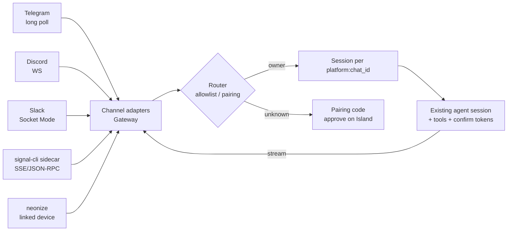

# Messaging Channels Research

Research date: 2026-09-10. Versions checked against PyPI, npm, and GitHub on
that date.

**The question:** how do we let the user talk to Marvi from Telegram,
WhatsApp, Discord, Slack, and Signal, reusing maintained SDKs instead of
writing protocol code ourselves?

**The short answer:** all five can run with **outbound-only connections**
(long polling, a WebSocket, or a linked device). That means no public webhook,
no tunnel, and no cloud relay, so it fits Marvi's local-only rule. Each
channel is a thin adapter in Gateway built on one maintained library.
[Hermes Agent](https://github.com/NousResearch/hermes-agent) (MIT, Python)
already ships all five, so we should use it as our reference implementation.

## The five channels

| # | Channel | Library (pinned 2026-09-10) | Transport | Public URL? | Setup | Risk |
|---|---|---|---|---|---|---|
| 1 | Telegram | `python-telegram-bot==22.8` (alt: `aiogram==3.31.0`) | `getUpdates` long polling | No | BotFather token | Low |
| 2 | Discord | `discord.py==2.7.1` (no `[voice]` extra) | Gateway WebSocket | No | Bot token + Message Content intent | Low |
| 3 | Slack | `slack-bolt==1.30.0` + `slack-sdk` | Socket Mode WebSocket | No | `xoxb-` bot token + `xapp-` app token | Low |
| 4 | Signal | `signal-cli` v0.14.7 sidecar, `httpx` client | Local HTTP daemon: SSE in, JSON-RPC out | No | Link as secondary device (QR) or register a number | Medium |
| 5 | WhatsApp | `neonize==0.4.3.post0` (whatsmeow Go core, has `win_amd64` wheels) | WhatsApp Web multi-device protocol | No | Link device (QR / pair code) | **High** |

Why these five: they are the top-used messengers that a personal assistant
can reach. Messenger and Instagram fall under the same Meta Business rules as
WhatsApp (see below). iMessage needs a Mac. WeChat, LINE, and similar are
regional and can be added later as the same kind of adapter.

## Per-channel notes

### 1. Telegram (start here)

- It has the simplest bot model, an official API, and no ban risk. Numeric user
  IDs make allowlisting easy.
- **Streaming:** Bot API 9.3 added `sendMessageDraft`, and Bot API 9.5
  (2026-03-01) opened it to all bots. You call it repeatedly with the same
  `draft_id` and growing text, and the client animates the message natively.
  This replaces the flickery `sendMessage` + `editMessageText` loop. If the
  PTB release you pin has no typed method for it, call
  `bot.do_api_request("sendMessageDraft", api_kwargs=...)`.
- **Confirm mode:** inline keyboard buttons carry the confirmation token id.
- **Voice notes:** download the OGG/Opus file and run it through the local
  STT we already have.

### 2. Discord

- Enable the **Message Content** privileged intent in the developer portal,
  or DM and message text arrive empty.
- Install without `[voice]`. Hermes notes that `discord.py[voice]` 2.7.1 pins
  `pynacl<1.6`, which has known CVEs. We don't need Discord voice.
- **Streaming:** edit one message. Edits are rate-limited to about 5 per 5 s
  per channel, so throttle to one edit per ~1 s.
- **Confirm mode:** buttons through `discord.ui.View`.

### 3. Slack

- Socket Mode (`AsyncSocketModeHandler.connect_async()`) replaces the HTTP
  Events endpoint, so no public URL is needed.
- **Streaming:** use Slack's native AI streaming (`chat.startStream` /
  `appendStream` / `stopStream`). `slack_sdk` wraps these as the `chat_stream`
  helper.
- **Don't mix this up with the existing Composio Slack connector.** Composio
  lets Marvi act *on the user's* Slack account (read, post, triggers). This
  bot is a separate Slack app the user *talks to*. They have different tokens
  and different trust levels, so keep both.

### 4. Signal

- There is no official bot API. `signal-cli` is the de-facto standard, and
  Hermes and OpenClaw both use it.
- Run `signal-cli daemon --http 127.0.0.1:<port>` as a Gateway-supervised
  sidecar. Inbound arrives on an SSE stream and outbound goes over JSON-RPC 2.0.
  No Python SDK is needed: Hermes's `gateway/platforms/signal.py` does this
  with plain `httpx`.
- **Windows cost:** it needs **JRE 25**. The native `libsignal` is bundled for
  Windows, but the GraalVM native build is Linux-only, so we would ship or
  locate a Temurin 25 JRE.
- Signal rate-limits new senders. Hermes has a separate
  `signal_rate_limit.py` for backoff and pacing, so copy that behaviour.

### 5. WhatsApp (last, opt-in, with a warning in the UI)

- **Official Cloud API: rejected.** Since 2026-01-15, Meta bans
  general-purpose AI assistants on the WhatsApp Business Platform, and Marvi
  is exactly that. The Cloud API also requires a public HTTPS webhook and a
  Meta Business account.
- **What's left is the unofficial linked-device protocol**, the same one
  WhatsApp Web uses:
  - **`neonize`** (recommended): pure `pip install`, a whatsmeow Go core, an
    async API, and `win_amd64` wheels (0.4.3.post0, 2026-07-12). It fits the
    Python Gateway with no Node sidecar.
  - **Baileys** `7.0.0-rc14` (Node): this is what Hermes (`scripts/whatsapp-bridge`)
    and OpenClaw use. It is more battle-tested, but it adds a Node process and
    a local HTTP bridge. Keep it as the fallback if neonize breaks. Hermes
    issue #7274 proposes the same neonize switch.
- **Risk:** automating a personal account breaks WhatsApp's ToS, and the
  account can be banned. Default to a dedicated number, or to "message
  yourself" self-chat only on the user's own number.

## Architecture in Marvi



- **Ownership:** Gateway owns the adapters, per AGENTS.md ("Gateway owns agent
  sessions, tool execution, confirmation tokens … connections to sidecars").
  Supervise `signal-cli` the same way the other sidecars are supervised. The
  renderer only shows status and handles setup (QR codes, tokens).
- **One small seam:** a normalized `ChannelMessage` and an adapter with
  `start()`, `stop()`, and `send()`. Don't build a plugin system until a sixth
  channel shows up. Hermes's `BasePlatformAdapter` is 4k lines, so copy its
  behaviours, not its size.
- **Deny by default:** add per-channel owner allowlists, plus Hermes-style DM
  pairing for new senders (8-character code, 1-hour expiry, 3 pending max,
  rate-limited, never logged). Approval happens on the Dynamic Island, not in
  chat.
- **Sessions:** use the key `platform:chat_id`. Cross-channel continuity (start
  on Telegram, finish by voice) comes from routing into the same memory, not
  from a new store.
- **Confirm/YOLO:** a confirmation request becomes platform buttons (Telegram,
  Discord, Slack) or a "reply YES <code>" message (Signal, WhatsApp), and
  resolves through the existing confirmation-token path. The YOLO indicator
  should also show in replies.
- **Secrets:** bot tokens and linked-device stores go through the existing
  `ask_secret` / settings path. They never enter model context.

## Security (the part the papers agree on)

Messaging channels are the most exposed input surface an agent has.

1. **Only the owner's typed text is a user turn.** Everything else goes to the
   model as a labelled untrusted-data block: contact names, vCards, location
   labels, forwarded messages, captions, file contents, and other people in
   group chats. Imperva showed invisible prompt injection against OpenClaw
   through WhatsApp contact names, vCard `FN` fields, and location labels.
   OpenClaw's fix (2026.4.23) moved those fields into a separate
   untrusted-metadata channel. Build it that way from day one.
2. **Untrusted input must not trigger consequential actions.** This is the
   core rule of the design-patterns paper and CaMeL's plan/data split. In
   Confirm mode, a channel turn that ingested untrusted content gets
   confirmation for every externally visible action.
3. **Groups are off by default.** When enabled, respond only to mentions, and
   only when the owner is the one mentioning.
4. **Redact phone numbers and IDs** in logs (Hermes `agent/redact.py`).
5. **Reconnect with exponential backoff and jitter.** Deduplicate inbound
   events and ignore the bot's own echoes to avoid reply loops.

## Rejected alternatives

| Option | Why not |
|---|---|
| Vercel Chat SDK (`chat` + `@chat-adapter/*`) | It's TypeScript and webhook-first, so it needs a public URL, and it would put agent sessions outside Gateway. It's good for serverless bots, but wrong for a local Python gateway. |
| Matrix + mautrix bridges | One protocol would cover everything, but it needs a homeserver plus a bridge per network. Hermes notes that `mautrix[encryption]` (python-olm) has no native Windows build. |
| WhatsApp Cloud API | Bans general AI assistants since 2026-01-15, and needs a public webhook. |
| Importing Hermes or OpenClaw wholesale | Each is a whole agent runtime. Use them as reference and port single adapters with provenance in `docs/UPSTREAM.md`. |
| Apprise | It only sends notifications and can't receive. Not needed until outbound-only push is wanted. |
| Composio for chat transport | Composio acts on the user's accounts. It isn't a bot endpoint the user talks to. |

## Build order

Deliver one milestone per step. Each needs tests: basic flow, tool call, error
behaviour, and the confirm transition.

1. **Telegram:** proves the seam, allowlist, sessions, confirm buttons,
   streaming drafts, and voice-note STT.
2. **Discord** and **Slack:** both are WebSocket bots with buttons, so they
   land together cheaply.
3. **Signal:** adds the JRE sidecar supervision.
4. **WhatsApp (neonize):** opt-in, with a ToS/ban warning and a
   dedicated-number default.

## Code sketches

These are verified against each library's current docs. They show how each
library sits inside Gateway's existing asyncio loop.

```python
# Telegram: python-telegram-bot 22.x inside an existing loop
from telegram.ext import Application, MessageHandler, filters

app = Application.builder().token(token).build()
app.add_handler(MessageHandler(filters.TEXT & ~filters.COMMAND, on_text))
await app.initialize(); await app.start(); await app.updater.start_polling()
# stop: await app.updater.stop(); await app.stop(); await app.shutdown()
```

```python
# Discord: discord.py 2.7
intents = discord.Intents.default(); intents.message_content = True
client = discord.Client(intents=intents)

@client.event
async def on_message(m):
    if m.author == client.user: return      # no reply loops
    ...
task = asyncio.create_task(client.start(token))   # stop: await client.close()
```

```python
# Slack: bolt Socket Mode, no public URL
from slack_bolt.async_app import AsyncApp
from slack_bolt.adapter.socket_mode.async_handler import AsyncSocketModeHandler

app = AsyncApp(token=bot_token)            # xoxb-

@app.event("message")
async def on_message(event, say): ...

handler = AsyncSocketModeHandler(app, app_token)   # xapp-
await handler.connect_async()              # stop: await handler.close_async()
```

```python
# WhatsApp: neonize async
from neonize.aioze.client import NewAClient
from neonize.aioze.events import MessageEv

client = NewAClient("whatsapp.sqlite3")    # linked-device store: treat as a secret

@client.event(MessageEv)
async def on_message(c: NewAClient, ev: MessageEv): ...

await client.connect()                     # first run prints a QR / pair code
```

```text
# Signal: signal-cli sidecar, spoken to with httpx
signal-cli -a +<number> daemon --http 127.0.0.1:<port>
  inbound : GET  /api/v1/events   (SSE)
  outbound: POST /api/v1/rpc      {"jsonrpc":"2.0","method":"send",...}
```

## Sources

Reference implementations
- Hermes Agent messaging gateway: https://hermes-agent.nousresearch.com/docs/user-guide/messaging/
  - adapter checklist: `gateway/platforms/ADDING_A_PLATFORM.md`
  - pairing: `gateway/pairing.py`
  - Signal adapter: `gateway/platforms/signal.py`
  - WhatsApp bridge: `scripts/whatsapp-bridge`
  - pins: `pyproject.toml`
- Hermes WhatsApp → neonize proposal: https://github.com/NousResearch/hermes-agent/issues/7274
- OpenClaw channels: https://openclawlab.com/en/docs/channels/

Libraries
- python-telegram-bot: https://pypi.org/project/python-telegram-bot/
- aiogram: https://github.com/aiogram/aiogram
- Telegram `sendMessageDraft`: https://core.telegram.org/bots/api-changelog
- discord.py: https://pypi.org/project/discord.py/
- Bolt Socket Mode (async): https://docs.slack.dev/tools/bolt-python/reference/adapter/socket_mode/async_handler.html
- Slack `chat.startStream`: https://docs.slack.dev/reference/methods/chat.startStream/
- signal-cli: https://github.com/AsamK/signal-cli
- signal-cli JSON-RPC: https://github.com/AsamK/signal-cli/wiki/JSON-RPC-service
- neonize: https://github.com/krypton-byte/neonize
- Baileys: https://www.npmjs.com/package/@whiskeysockets/baileys

Policy
- Meta WhatsApp general-purpose chatbot ban: https://techcrunch.com/2025/10/18/whatssapp-changes-its-terms-to-bar-general-purpose-chatbots-from-its-platform/
- respond.io explainer: https://respond.io/blog/whatsapp-general-purpose-chatbots-ban

Papers and security research
- Debenedetti et al., *Defeating Prompt Injections by Design* (CaMeL), 2025: https://arxiv.org/abs/2503.18813
- Beurer-Kellner et al., *Design Patterns for Securing LLM Agents against Prompt Injections*, 2025: https://arxiv.org/abs/2506.08837
- Deng et al., *Taming OpenClaw: Security Analysis and Mitigation of Autonomous LLM Agent Threats*, 2026: https://arxiv.org/abs/2603.11619
- *A Security Analysis of the OpenClaw AI Agent Framework*, 2026: https://arxiv.org/abs/2603.27517
- Imperva, *Compromise OpenClaw with Prompt Injections in Message Objects*: https://www.imperva.com/blog/compromise-openclaw-with-prompt-injections-in-message-objects/
